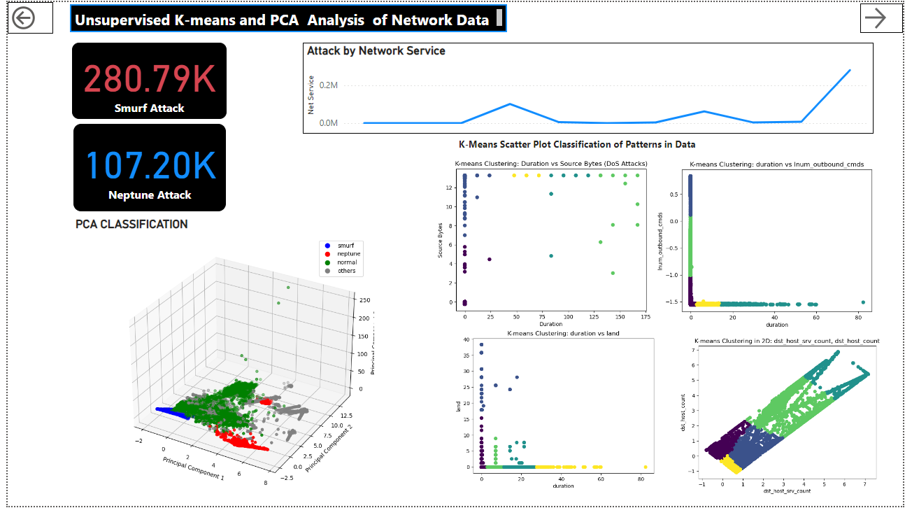
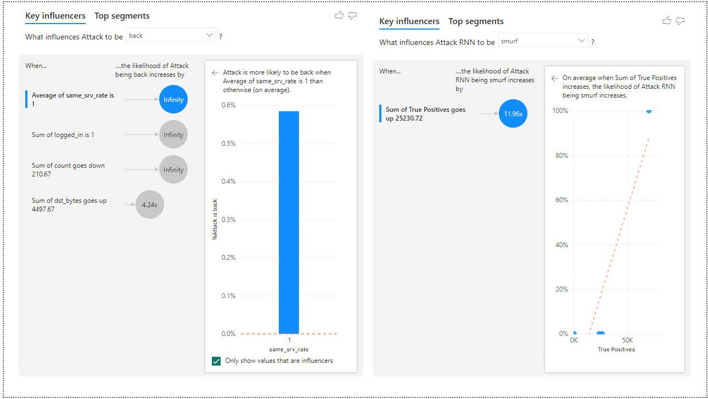

# 🔍 Intrusion Detection Dashboard Using Power BI

## Overview
This repository contains the Power BI dashboard developed for my thesis on intrusion detection. The dashboard provides a comprehensive analysis of network intrusion data, leveraging various machine learning techniques to identify and classify attacks. It includes visualizations and metrics to help understand the data and the performance of different models.

### 📊 Dashboard Structure
The dashboard is structured into the following pages:

1. **Intrusion Detection Summary**
2. **Classification Techniques**
3. **Machine Learning with SNN**
4. **Machine Learning with RNN**
5. **Machine Learning with MLP**
6. **Performance and Metrics**
7. **Key Influencers**

## 1. 🛡️ Intrusion Detection Summary

The Intrusion Detection Summary page provides a high-level overview of the dataset used for intrusion detection. This includes:
- Total dataset size
- Number of normal and attack instances
- Types of attacks

Visualizations on this page include:
- A table summarizing the dataset
- A bar chart showing the distribution of attack types
- A pie chart depicting the proportion of normal and attack instances

## 2. 🔬 Classification Techniques


The Classification Techniques page details the methods used for anomaly detection:
- **k-Means Clustering**
- **Principal Component Analysis (PCA)**

This section also includes images from the thesis results, particularly PCA plots, and reduces the high dimensionality to lower dimensioanlity to capture patterns and trends of attack types in data.

## 3. 🧠 Machine Learning with SNN


The SNN page presents the results of using a Spiking Neural Network for intrusion detection. Key components include:
- Confusion matrix results
- Tables showing false positives, true positives, and false negatives for top attacks

## 4. 🔄 Machine Learning with RNN


The RNN page details the implementation and results of using a Recurrent Neural Network. This includes:
- Confusion matrix plots
- Tables showing false positives, true positives, and false negatives for top attacks

## 5. 🤖 Machine Learning with MLP
The MLP page covers the use of a Multilayer Perceptron for intrusion detection. This section contains:
- Confusion matrix results
- Tables showing false positives, true positives, and false negatives for top attacks

## 6. 📈 Performance and Metrics

The Performance and Metrics page provides a comparative analysis of the different machine learning models used in the project. Visualizations include:
- Accuracy curves
- False positive and false negative rates
- Performance comparison plots for SNN, RNN, and MLP models

## 7. 🔍 Key Influencers

The Key Influencers page identifies and visualizes the most significant factors influencing the detection of intrusions. This analysis highlights:
- Causes of attack increases
- Contributions to high false positive and false negative rates

## 📥 Instructions to Access and Use the Dashboard
To access and use the Power BI dashboard:

1. Clone the repository to your local machine:
   ```sh
   git clone https://github.com/yourusername/intrusion-detection-dashboard.git
